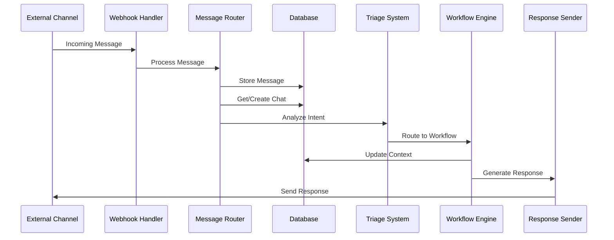
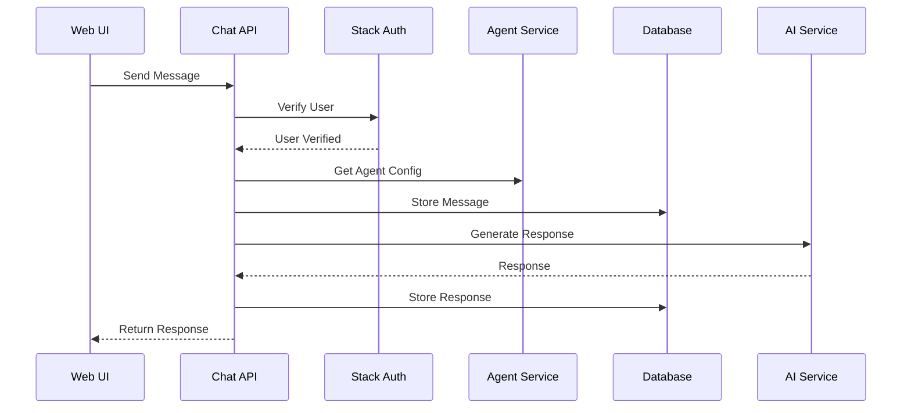

# A1Zap Messaging System Implementation Guide

## Overview

This guide outlines the implementation of a multi-agent messaging system in A1Zap, based on A1Framework's architecture but extended to support multiple AI agents managed by different users.

## Table of Contents

1. [Architecture Overview](#architecture-overview)
2. [Database Schema Changes](#database-schema-changes)
3. [Implementation Phases](#implementation-phases)
4. [Core Components](#core-components)
5. [API Endpoints](#api-endpoints)
6. [Message Flow](#message-flow)
7. [Multi-Agent Routing](#multi-agent-routing)
8. [Integration Points](#integration-points)
9. [Migration Strategy](#migration-strategy)

## Architecture Overview

### Key Differences from A1Framework

1. **Multi-Agent Support**: Each user can have multiple AI agents
2. **Stack Auth Integration**: User authentication via Stack Auth instead of Supabase Auth
3. **Agent Isolation**: Messages and conversations are scoped to specific agents
4. **Subscription-Based**: Message limits and agent counts based on subscription plans

### System Components

```
┌─────────────────┐     ┌─────────────────┐     ┌─────────────────┐
│  Stack Auth     │     │   Web UI        │     │  External       │
│  (User Auth)    │     │  (Dashboard)    │     │  Channels       │
└────────┬────────┘     └────────┬────────┘     └────────┬────────┘
         │                       │                         │
         └───────────────────────┴─────────────────────────┘
                                 │
                    ┌────────────▼────────────┐
                    │    A1Zap API Layer      │
                    │  (Message Router)       │
                    └────────────┬────────────┘
                                 │
                ┌────────────────┼────────────────┐
                │                │                │
     ┌──────────▼──────┐  ┌─────▼──────┐  ┌─────▼──────┐
     │ Agent Manager   │  │  Message   │  │  Triage    │
     │                 │  │  Processor │  │  System    │
     └─────────────────┘  └────────────┘  └────────────┘
                │                │                │
                └────────────────┼────────────────┘
                                 │
                    ┌────────────▼────────────┐
                    │    Supabase Database    │
                    │  (Messages, Chats, etc) │
                    └─────────────────────────┘
```

## Database Schema Changes

### New Tables Added

1. **conversation_users**: External users chatting with agents
2. **chats**: Conversation threads between users and agents
3. **chat_participants**: Junction table for chat members
4. **projects**: Tasks/workflows managed by agents
5. **email_scheduled_reports**: Scheduled email reports per agent

### Modified Tables

1. **messages**: Extended to support chat system
2. **a1_agents**: Added messaging configuration fields
3. **agent_conversations**: Linked to new chat system

### Key Relationships

```sql
-- Each agent belongs to a user
a1_agents.owner_id -> users.id

-- Each chat is handled by an agent
chats.agent_id -> a1_agents.id

-- Messages belong to chats and agents
messages.chat_id -> chats.id
messages.agent_id -> a1_agents.id

-- Conversation users can be linked to Stack Auth users
conversation_users.stack_auth_user_id -> users.id
```

## Implementation Phases

### Phase 1: Core Infrastructure (Week 1-2)

1. **Database Setup**
   - Run the Supabase initial setup SQL
   - Create database adapter layer
   - Implement connection pooling

2. **Basic Message Processing**
   - Create message ingestion endpoints
   - Implement message persistence
   - Build basic response generation

3. **Agent Management**
   - Extend agent creation to include messaging config
   - Add agent status management
   - Implement agent-specific settings

### Phase 2: Channel Integration (Week 3-4)

1. **Web Chat Interface**
   - Build chat UI component
   - Implement real-time messaging
   - Add typing indicators

2. **Email Integration**
   - Set up email webhook endpoint
   - Implement email parsing
   - Build email response formatting

3. **WhatsApp Integration** (if using A1Base)
   - Configure webhook endpoints
   - Handle multimedia messages
   - Implement message status tracking

### Phase 3: AI & Triage System (Week 5-6)

1. **Triage Implementation**
   - Port triage logic from A1Framework
   - Adapt for multi-agent routing
   - Implement confidence scoring

2. **Workflow System**
   - Basic response workflow
   - Project management workflow
   - Custom workflow framework

3. **Memory & Context**
   - Implement conversation memory
   - Add user preference tracking
   - Build context handoff system

### Phase 4: Advanced Features (Week 7-8)

1. **Multi-Agent Coordination**
   - Agent selection logic
   - Inter-agent communication
   - Escalation paths

2. **Analytics & Monitoring**
   - Message analytics dashboard
   - Agent performance metrics
   - Usage tracking

3. **Optimization**
   - Response caching
   - Query optimization
   - Load balancing

## Core Components

### 1. Database Adapter

Create a Supabase adapter that extends the existing database layer:

```typescript
// src/lib/messaging/supabase-adapter.ts
import { db } from '@/lib/db-supabase';
import { WebhookPayload } from './types';

export class MessagingAdapter {
  async processWebhookPayload(payload: WebhookPayload, agentId: string) {
    // 1. Get or create conversation user
    const userId = await this.getOrCreateConversationUser(
      payload.sender_number,
      payload.sender_name,
      payload.service
    );

    // 2. Get or create chat
    const chatId = await this.getOrCreateChat(
      payload.thread_id,
      payload.thread_type,
      payload.service,
      agentId
    );

    // 3. Add participants
    await this.addChatParticipant(chatId, userId);

    // 4. Store message
    return await this.storeMessage({
      chatId,
      senderId: userId,
      content: payload.message_content.text || '',
      messageType: payload.message_type,
      externalId: payload.message_id,
      service: payload.service,
      agentId,
      richContent: payload.message_content,
    });
  }

  // Additional methods...
}
```

### 2. Message Router

Route incoming messages to the appropriate agent:

```typescript
// src/lib/messaging/message-router.ts
export class MessageRouter {
  async routeMessage(
    message: IncomingMessage,
    availableAgents: Agent[]
  ): Promise<Agent> {
    // 1. Check if there's an existing conversation
    const existingChat = await this.findExistingChat(message);
    if (existingChat) {
      return existingChat.agent;
    }

    // 2. Analyze message intent
    const intent = await this.analyzeIntent(message);

    // 3. Score agents based on capabilities
    const scores = await this.scoreAgents(availableAgents, intent);

    // 4. Return best matching agent
    return scores[0].agent;
  }
}
```

### 3. Triage System

Adapt the triage system for multi-agent context:

```typescript
// src/lib/messaging/triage.ts
export async function triageMessage(
  message: Message,
  agent: Agent,
  context: ConversationContext
): Promise<TriageResult> {
  const systemPrompt = agent.system_prompt || getDefaultSystemPrompt();
  
  const result = await openai.chat.completions.create({
    model: agent.model_settings?.model || 'gpt-4',
    messages: [
      { role: 'system', content: systemPrompt },
      { role: 'system', content: getTriagePrompt(agent) },
      ...context.messages,
      { role: 'user', content: message.content }
    ],
    response_format: { type: 'json_object' }
  });

  return JSON.parse(result.choices[0].message.content);
}
```

### 4. Response Generator

Generate responses using agent-specific settings:

```typescript
// src/lib/messaging/response-generator.ts
export async function generateResponse(
  agent: Agent,
  triageResult: TriageResult,
  context: ConversationContext
): Promise<string> {
  const workflow = getWorkflow(triageResult.responseType);
  
  return await workflow.execute({
    agent,
    context,
    triageResult,
    llmProvider: getLLMProvider(agent.model_settings)
  });
}
```

## API Endpoints

### 1. Webhook Endpoints

```typescript
// src/app/api/webhooks/messaging/route.ts
export async function POST(request: Request) {
  const payload = await request.json();
  const agentId = request.headers.get('x-agent-id');
  
  if (!agentId) {
    return Response.json({ error: 'Agent ID required' }, { status: 400 });
  }

  // Process webhook
  await processWebhook(payload, agentId);
  
  return Response.json({ success: true });
}
```

### 2. Chat API

```typescript
// src/app/api/agents/[agentId]/chat/route.ts
export async function POST(
  request: Request,
  { params }: { params: { agentId: string } }
) {
  const { message } = await request.json();
  const user = await requireUser();
  
  // Verify agent ownership
  const agent = await verifyAgentOwnership(params.agentId, user.id);
  
  // Process message
  const response = await processUserMessage(message, agent, user);
  
  return Response.json(response);
}
```

### 3. Conversation Management

```typescript
// src/app/api/agents/[agentId]/conversations/route.ts
export async function GET(
  request: Request,
  { params }: { params: { agentId: string } }
) {
  const user = await requireUser();
  const agent = await verifyAgentOwnership(params.agentId, user.id);
  
  const conversations = await db
    .select()
    .from(chats)
    .where(eq(chats.agentId, agent.id))
    .orderBy(desc(chats.lastMessageAt));
    
  return Response.json(conversations);
}
```

## Message Flow

### Incoming Message Flow



### Web UI Message Flow



## Multi-Agent Routing

### Agent Selection Strategy

1. **Direct Routing**: Messages to specific agent endpoints
2. **Smart Routing**: Analyze message and route to best agent
3. **Escalation**: Transfer between agents when needed

```typescript
// src/lib/messaging/agent-selector.ts
export class AgentSelector {
  async selectAgent(
    message: Message,
    userAgents: Agent[]
  ): Promise<Agent> {
    // 1. Check for explicit agent mention
    const mentionedAgent = this.checkMentions(message, userAgents);
    if (mentionedAgent) return mentionedAgent;

    // 2. Check conversation history
    const previousAgent = await this.checkHistory(message);
    if (previousAgent) return previousAgent;

    // 3. Analyze message intent
    const intent = await this.analyzeIntent(message);

    // 4. Score agents
    const scores = await this.scoreAgents(userAgents, intent);

    // 5. Return best match
    return scores[0].agent;
  }

  private async scoreAgents(
    agents: Agent[],
    intent: Intent
  ): Promise<ScoredAgent[]> {
    return Promise.all(
      agents.map(async (agent) => ({
        agent,
        score: await this.calculateScore(agent, intent)
      }))
    ).then(scores => scores.sort((a, b) => b.score - a.score));
  }
}
```

### Context Handoff

When transferring between agents:

```typescript
interface AgentHandoff {
  fromAgent: string;
  toAgent: string;
  reason: string;
  context: {
    conversation: Message[];
    summary: string;
    userInfo: any;
    currentTask?: any;
  };
}

async function handoffConversation(
  handoff: AgentHandoff
): Promise<void> {
  // 1. Update chat assignment
  await db
    .update(chats)
    .set({ agentId: handoff.toAgent })
    .where(eq(chats.id, handoff.chatId));

  // 2. Create handoff message
  await createSystemMessage(
    handoff.chatId,
    `Conversation transferred from ${handoff.fromAgent} to ${handoff.toAgent}: ${handoff.reason}`
  );

  // 3. Notify new agent
  await notifyAgent(handoff.toAgent, handoff.context);
}
```

## Integration Points

### 1. Stack Auth Integration

```typescript
// src/lib/messaging/auth-integration.ts
export async function linkConversationUser(
  conversationUserId: string,
  stackAuthUserId: string
): Promise<void> {
  await db
    .update(conversationUsers)
    .set({ stackAuthUserId })
    .where(eq(conversationUsers.id, conversationUserId));
}
```

### 2. Existing Agent System

```typescript
// src/lib/messaging/agent-integration.ts
export async function extendAgentWithMessaging(
  agentId: string,
  messagingConfig: MessagingConfig
): Promise<void> {
  await db
    .update(a1Agents)
    .set({
      systemPrompt: messagingConfig.systemPrompt,
      respondOnlyWhenMentioned: messagingConfig.respondOnlyWhenMentioned,
      messageSettings: messagingConfig.messageSettings,
    })
    .where(eq(a1Agents.id, agentId));
}
```

### 3. UI Components

Create reusable chat components:

```typescript
// src/components/chat/agent-chat.tsx
export function AgentChat({ agentId }: { agentId: string }) {
  const [messages, setMessages] = useState<Message[]>([]);
  const [input, setInput] = useState('');

  const sendMessage = async () => {
    const response = await fetch(`/api/agents/${agentId}/chat`, {
      method: 'POST',
      body: JSON.stringify({ message: input }),
    });
    
    const data = await response.json();
    setMessages([...messages, data.userMessage, data.agentResponse]);
    setInput('');
  };

  return (
    <div className="flex flex-col h-full">
      <MessageList messages={messages} />
      <MessageInput
        value={input}
        onChange={setInput}
        onSend={sendMessage}
      />
    </div>
  );
}
```

## Migration Strategy

### 1. Database Migration

```bash
# 1. Run the new SQL setup
psql $DATABASE_URL < supabase/initial-setup.sql

# 2. Migrate existing messages
npm run migrate:messages

# 3. Update agent configurations
npm run migrate:agents
```

### 2. Code Migration

1. **Update Imports**: Change from old message table to new structure
2. **Add Adapters**: Create compatibility layers for existing code
3. **Gradual Rollout**: Enable messaging per agent

### 3. Testing Strategy

```typescript
// src/__tests__/messaging/integration.test.ts
describe('Messaging System', () => {
  it('should route messages to correct agent', async () => {
    const agent = await createTestAgent();
    const message = await sendTestMessage(agent.id);
    
    expect(message.agentId).toBe(agent.id);
  });

  it('should handle agent handoffs', async () => {
    const [agent1, agent2] = await createTestAgents(2);
    const chat = await startChat(agent1.id);
    
    await handoffChat(chat.id, agent2.id);
    
    const updatedChat = await getChat(chat.id);
    expect(updatedChat.agentId).toBe(agent2.id);
  });
});
```

## Performance Considerations

### 1. Database Optimization

- Add appropriate indexes (already in SQL)
- Use connection pooling
- Implement query result caching

### 2. Message Processing

- Queue long-running operations
- Implement rate limiting per agent
- Cache AI responses when appropriate

### 3. Scaling Strategy

- Horizontal scaling of API servers
- Message queue for webhook processing
- Separate read/write database connections

## Security Considerations

### 1. Agent Isolation

- Ensure agents can only access their own conversations
- Implement proper authorization checks
- Audit all cross-agent operations

### 2. Data Privacy

- Encrypt sensitive message content
- Implement data retention policies
- Provide user data export functionality

### 3. Rate Limiting

```typescript
// src/lib/messaging/rate-limiter.ts
export async function checkRateLimit(
  agentId: string,
  userId: string
): Promise<boolean> {
  const subscription = await getUserSubscription(userId);
  const usage = await getMonthlyUsage(agentId);
  
  return usage.messageCount < subscription.maxMessagesPerMonth;
}
```

## Monitoring & Analytics

### 1. Key Metrics

- Messages per agent per day
- Response time percentiles
- Triage accuracy
- Handoff frequency

### 2. Dashboard Components

```typescript
// src/components/analytics/messaging-stats.tsx
export function MessagingStats({ agentId }: { agentId: string }) {
  const stats = useMessagingStats(agentId);
  
  return (
    <div className="grid grid-cols-4 gap-4">
      <StatCard title="Total Messages" value={stats.totalMessages} />
      <StatCard title="Active Chats" value={stats.activeChats} />
      <StatCard title="Avg Response Time" value={stats.avgResponseTime} />
      <StatCard title="Satisfaction" value={stats.satisfaction} />
    </div>
  );
}
```

## Next Steps

1. **Review** the SQL schema and make any necessary adjustments
2. **Set up** the database with the new schema
3. **Implement** Phase 1 core infrastructure
4. **Test** with a single agent before rolling out
5. **Iterate** based on user feedback

## Resources

- [A1Framework Message Processing Architecture](./MESSAGE_PROCESSING_ARCHITECTURE.md)
- [Supabase Documentation](https://supabase.com/docs)
- [AI SDK Documentation](https://sdk.vercel.ai/docs)
- [Stack Auth Documentation](https://stack-auth.com/docs) 